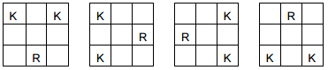

It is also worth to read connected article [how to improve algorithm speed](http://clojure.wladyka.eu/posts/2015-08-24-how-to-improve-algorithm-speed.html).

# Problem to solve

The problem is to find all unique configurations of a set of normal chess pieces on
a chess board with dimensions MxN where none of the pieces is in a position to take any of the
others. Assume the colour of the piece does not matter, and that there are no pawns among the
pieces.

Write a program which takes as input:

1. The dimensions of the board: M, N
2. The number of pieces of each type (King, Queen, Bishop, Rook and Knight) to try and
place on the board.

As output, the program should list all the unique configurations to the console for which all of the
pieces can be placed on the board without threatening each other.

# What we want to achieve

Input: 3x3 board containing 2 Kings and 1 Rook.



Input: 4x4 board containing 2 Rooks and 4 Knights.


# How to use app

**REPL**

Get solutions for board 3x3 1rook 2kings in REPL:

```clojure
(chess-challenge.handler/get-solutions [3 3] '(:rook :king :king))
```

**JAR file**

Run function chess-challenge.handler/-main as jar file.

Compile uberjar with command `lein uberjar`.

Run jar file:
```
java -Xms4g -Xmx4g -jar target/uberjar/chess-challenge-0.1.0-SNAPSHOT-standalone.jar
```

Please notice `-Xms4g -Xmx4g` is not obligatory but it will increase performance.